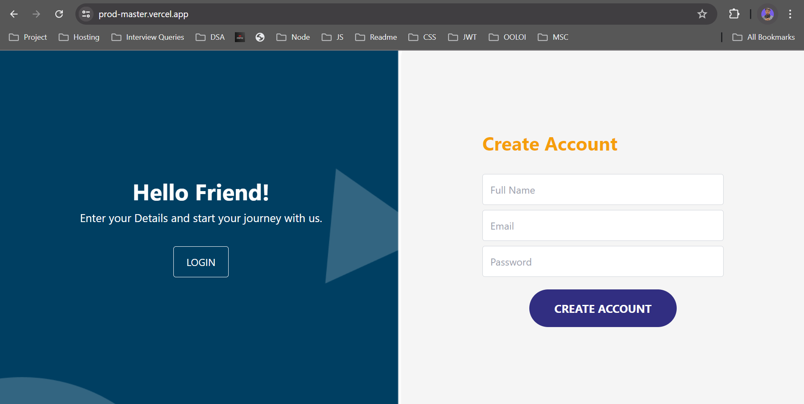
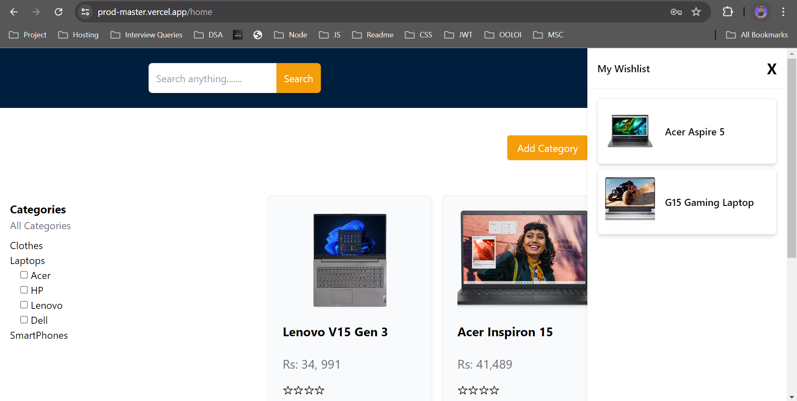

# ProdMaster

**ProdMaster is a product management application, where users can create categories and sub categories for products, can add product details with wishlist feature.**
**Developed using MERN.**


## Links

- Live Link: [ProdMaster Live](https://prod-master.vercel.app/)

<!-- - Server: [Server](https://prodmaster-backend.onrender.com/api/) -->

- Loom Recorded Video 2: [Code Summary](https://www.loom.com/share/630ee7a9c02444bcb5f2382677fbcfe4?sid=14f33dbe-16c8-41fa-bf2a-11cf2bf01701)

- API Documentation: [Postman](https://documenter.getpostman.com/view/26846855/2sA3e1BVxT)


## Features

- **Backend**: NodeJS with Expressjs framework for backend.
- **Authentication**: Token-based authentication using JWT.
- **Database**: MongoDB with Mongoose for data modeling.
- **Frontend**: ReactJS with Tailwind CSS for Frontend.
- **State Management**: Redux Toolkit for managing global application state.
- **Data Fetching**: RTK Query for data fetching.
- **Image Storage**: Firebase Storage for storing product images.

---


## Screenshots



---


---


---


---


---



---


## Follow these steps to run this on your local machine:

### Prerequisites

    - Node.js (v14.x or later)
    - npm (v6.x or later) or yarn (v1.22.x or later)
    - Git


### Clone the repository 
    - git clone https://github.com/Sharukhhh/ProdMaster.git


### Setting up the Backend

- Navigate to the backend directory:
    ```sh
    cd back-end
    ```

- Install the dependencies:
    ```sh
    npm install
    ```

- Start the backend server:
    ```sh
    npm start
    ```

### Setting up the Frontend

- Navigate to the frontend directory:
    ```sh
    cd front-end
    ```

- Install the dependencies:
    ```sh
    npm install
    ```

- Start the frontend server:
    ```sh
    npm run dev
    ```
